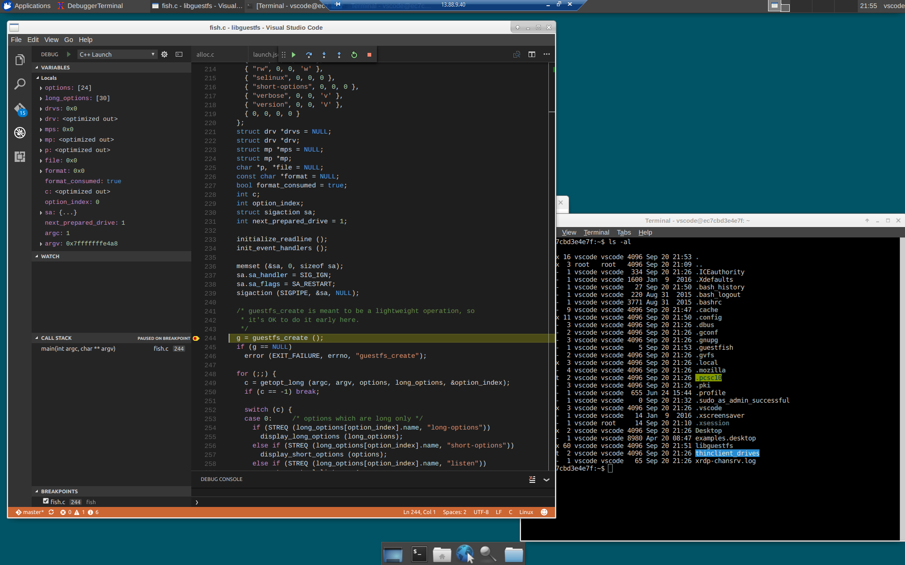

Visual Studio Code with RDP support in a Docker Container
=========================================================

I wanted to be able to provision an Azure Linux Ubuntu VM 
where I could setup a standalone development environment 
that could run Visual Studio Code. Being able to RDP from Windows
into this VM container and be able to code and debug makes it 
more pleasant!  I also wanted to make sure some conveniences 
were working, like clipboard support across Windows/Linux
as the default XRDP package installed doesn't appear to support it. 
Also, it takes care of installing some nicer fonts and fixes
the Tab key mapping.

Run
---

./run.sh [port]

Connect using an RDP client to the port (default is 5000) to the container 
as user `vscode` with password `vscode` (defaults).

When prompted to pick a session use the "Default".

Build
-----

./build.sh

Reconfigure the USERNAME and PASSWORD variables in Dockerfile to alter the
login accounts for RDP.
